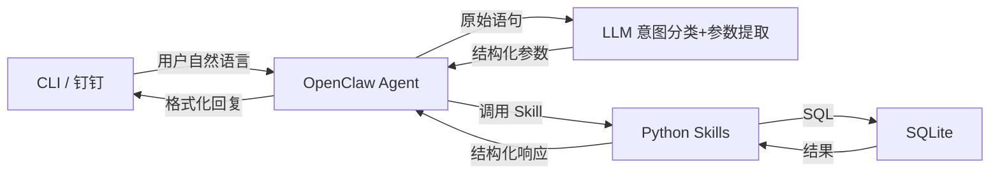

# AI 会议室预约助手 — 设计文档

**日期：** 2026-07-13  
**版本：** v1.0  

---

## 一、项目概述

基于 OpenClaw 框架开发 AI 会议室预约助手，以钉钉群机器人形态加入学院钉钉群。师生通过 @机器人 + 自然语言即可完成会议室查询、预约、取消等操作。

**核心链路：** 钉钉群 @机器人 → OpenClaw Agent → LLM 语义解析 → 调用 Skill (Python) → SQLite 数据库 → 结果返回钉钉群

---

## 二、项目目录结构

```
ddtalk/
├── docs/superpowers/specs/    ← 设计文档
├── db/
│   ├── schema.sql             ← 建表 SQL
│   └── seed_data.sql          ← 测试种子数据
├── skills/
│   ├── __init__.py
│   ├── db_manager.py          ← 数据库连接 & 基础操作
│   ├── room_query.py          ← 空闲查询 & 预约总览
│   ├── booking.py             ← 预约 + 冲突检测 + 推荐
│   ├── cancellation.py        ← 取消预约 & 个人查询
│   └── time_parser.py         ← 模糊时间解析
├── prompts/
│   ├── system_prompt.md       ← 系统角色 & 能力定义
│   ├── intent_classify.md     ← 意图分类提示词
│   └── response_format.md     ← 返回格式模板
├── cli/
│   └── test_shell.py          ← 命令行测试入口
├── tests/
│   ├── test_room_query.py
│   ├── test_booking.py
│   ├── test_cancellation.py
│   ├── test_time_parser.py
│   └── test_scenarios.py      ← 15+ 集成测试用例
├── requirements.txt
└── README.md
```

---

## 三、数据库设计 (SQLite)

### 3.1 rooms 表 — 会议室资源

| 字段 | 类型 | 约束 | 说明 |
|------|------|------|------|
| id | INTEGER | PK AUTOINCREMENT | 房间 ID |
| name | TEXT | NOT NULL UNIQUE | 房间名称（如"信电楼330"） |
| building | TEXT | NOT NULL | 楼栋名称 |
| floor | INTEGER | NOT NULL | 楼层 |
| capacity | INTEGER | NOT NULL | 容量（人数） |
| facilities | TEXT | DEFAULT '' | 设备（投影仪/白板/视频会议） |
| status | TEXT | DEFAULT 'available' | available / maintenance |
| description | TEXT | DEFAULT '' | 备注 |

### 3.2 reservations 表 — 预约记录

| 字段 | 类型 | 约束 | 说明 |
|------|------|------|------|
| id | INTEGER | PK AUTOINCREMENT | 预约 ID（对外展示用） |
| room_id | INTEGER | FK → rooms.id | 关联房间 |
| user_id | TEXT | NOT NULL | 钉钉用户 ID |
| user_name | TEXT | NOT NULL | 用户姓名 |
| date | TEXT | NOT NULL | 日期 YYYY-MM-DD |
| start_time | TEXT | NOT NULL | 开始时间 HH:MM |
| end_time | TEXT | NOT NULL | 结束时间 HH:MM |
| status | TEXT | DEFAULT 'active' | active / cancelled |
| created_at | TEXT | NOT NULL | 创建时间戳 ISO8601 |

### 3.3 冲突检测逻辑

```sql
SELECT COUNT(*) FROM reservations
WHERE room_id = ?
  AND date = ?
  AND status = 'active'
  AND start_time < ?
  AND end_time > ?;
```

若 COUNT > 0，则该时段已被占用。

---

## 四、Skills 模块设计

### 4.1 db_manager.py — 数据库管理器

- `get_connection()` — 获取数据库连接
- `init_db()` — 执行建表 SQL
- `seed_data()` — 插入测试数据

### 4.2 room_query.py — 房间查询

| 函数 | 说明 | OpenClaw Skill 名 |
|------|------|------------------|
| `query_available(date, start, end)` | 查询指定时段空闲房间列表 | `query_rooms` |
| `query_overview(date, start, end)` | 查询所有房间在指定时段的占用/空闲状态 | `query_rooms` |
| `get_room_by_name(name)` | 按名称查找房间 | （内部调用） |

### 4.3 booking.py — 预约核心

| 函数 | 说明 | OpenClaw Skill 名 |
|------|------|------------------|
| `book_room(user_id, user_name, room_name, date, start, end)` | 预约房间，自动冲突检测 | `book_room` |
| `recommend_alternatives(room_name, date, start, end)` | 目标占用时推荐容量相近替代房间 | `book_room`（内部调用） |

**冲突处理流程：**
1. 检测目标房间 + 时段是否冲突
2. 无冲突 → 插入预约记录，返回成功
3. 有冲突 → 调用 `recommend_alternatives`，返回替代推荐列表

**推荐算法：**
- 筛选同楼栋 / 同楼层、该时段空闲的房间
- 按容量差异升序排列（容量最接近的优先）
- 返回 Top 3

### 4.4 cancellation.py — 预约管理

| 函数 | 说明 | OpenClaw Skill 名 |
|------|------|------------------|
| `my_reservations(user_id)` | 查询我的有效预约列表 | `manage_reservation` |
| `cancel_reservation(user_id, reservation_id)` | 取消预约（仅限本人） | `manage_reservation` |

### 4.5 time_parser.py — 模糊时间解析

| 函数 | 说明 |
|------|------|
| `parse_fuzzy_datetime(text)` | 将"明天下午""傍晚""后天"等转为标准日期+时间段 |
| `get_current_date()` | 获取当前日期 |
| `PERIOD_MAP` | 时段映射字典（上午/中午/下午/傍晚/晚上 → HH:MM-HH:MM） |

**支持的自然语言表达：**
- "现在" → 当前时间
- "今天/明天/后天" → 对应日期
- "上午/中午/下午/傍晚/晚上" → 标准时段
- "明天下午" → 明天日期 + 下午时段
- "下周一" → 下周对应的星期一

---

## 五、LLM 提示词设计

### 5.1 系统提示词 (system_prompt.md)

定义角色、能力边界、输出格式要求：
- 你是学院会议室预约助手
- 核心能力：预约、查询、取消、推荐
- 回复风格：简洁友好，结构化展示信息
- 边界处理：不理解时友好引导用户重新描述

### 5.2 意图分类 (intent_classify.md)

| 用户意图 | 关键词 | 对应 Skill |
|---------|--------|-----------|
| 预约房间 | 约、定、订、预约、book | `book_room` |
| 查空闲 | 空闲、空的、有哪些、空房间 | `query_rooms` |
| 预约总览 | 预约情况、占用情况、都谁约了 | `query_rooms` |
| 我的预约 | 我的预约、我约了、我订了 | `manage_reservation` |
| 取消预约 | 取消、退订、不要了 | `manage_reservation` |

### 5.3 返回格式模板 (response_format.md)

- 预约成功：`预约成功！{房间名} | {日期} {开始}-{结束} | ID: {预约ID}`
- 冲突推荐：`{房间名}已满，推荐：1. {房间名}（容量{人数}）2. ...`
- 空闲列表：房间名 + 容量 + 设备信息
- 预约总览：按房间列出占用/空闲状态
- 错误提示：友好自然语言，不含技术错误信息

---

## 六、命令行测试入口

`cli/test_shell.py` 模拟钉钉用户交互：

```
=== AI 会议室预约助手 — 命令行测试模式 ===
当前模拟用户: user001 (张三)
输入 'help' 查看帮助, 'quit' 退出

> 帮我约明天下午 330
📋 意图: book | 参数: room=330, date=2026-07-14, 14:00-18:00
✅ 预约成功！信电楼330 | 7月14日 14:00-18:00 | ID: 1001

> 现在有哪些空房间？
📋 意图: query_available
📋 当前空闲房间: 317(20人), 501(30人), 212(10人)
```

---

## 七、测试用例覆盖（15+）

| # | 类别 | 用例 | 预期结果 |
|---|------|------|---------|
| 1 | 基础预约 | 正常预约空闲房间 | 预约成功，返回 ID |
| 2 | 基础预约 | 预约已占用的房间时段 | 返回冲突 + 推荐替代 |
| 3 | 基础预约 | 预约不存在的房间号 | 友好提示房间不存在 |
| 4 | 空闲查询 | 查询当前空闲房间 | 返回空闲列表 |
| 5 | 空闲查询 | 查询指定时段空闲 | 返回该时段空闲列表 |
| 6 | 预约总览 | 查询某时段所有房间状态 | 返回占用/空闲一览 |
| 7 | 模糊时间 | "明天下午" | 正确解析为明日+下午时段 |
| 8 | 模糊时间 | "傍晚" | 正确解析为 18:00-21:00 |
| 9 | 模糊时间 | "后天上午" | 正确解析为后天+上午时段 |
| 10 | 冲突推荐 | 目标房间占用时推荐替代 | 返回容量相近房间 |
| 11 | 冲突推荐 | 所有房间都满 | 友好提示无可用房间 |
| 12 | 个人管理 | 查询我的预约 | 返回本人预约列表 |
| 13 | 个人管理 | 取消自己的预约 | 取消成功 |
| 14 | 个人管理 | 取消别人的预约 | 拒绝，权限不足 |
| 15 | 边界情况 | 输入无法理解的乱码 | 友好引导重新描述 |
| 16 | 边界情况 | 非开放时段（如凌晨） | 提示不在服务时段 |
| 17 | 边界情况 | 过去的时间预约 | 提示不能预约过去时间 |

---

## 八、数据流



**数据格式约定（Agent ↔ Skill）：**

Skill 输入：JSON 字符串
```json
{"action": "book", "user_id": "user001", "user_name": "张三", "room_name": "330", "date": "2026-07-14", "start_time": "14:00", "end_time": "18:00"}
```

Skill 输出：JSON 字符串
```json
{"success": true, "message": "预约成功！信电楼330 | 7月14日 14:00-18:00 | ID: 1001", "data": {"reservation_id": 1001}}
```
