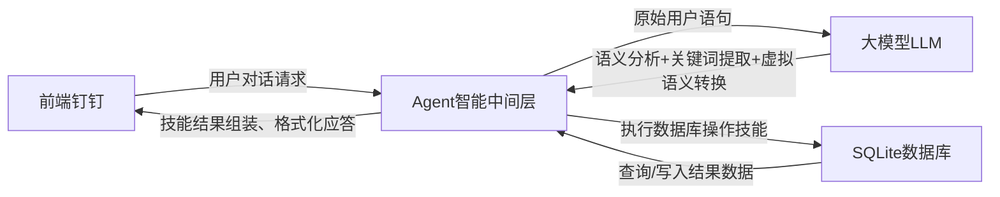

**整体说明**

AI 会议室预约助手

**数据流**

前端钉钉-->agent；

agent-->大模型；

大模型--|分析语句，提炼关键字，转换虚拟表达|>agent；

agent--|调用相应的skills，操作数据库|>SQligt；

SQligt-->agent;

agent--|调用skills，组装返回词|>前端

**注意**
这个项目是以钉钉群机器人（虚拟用户）的形态，直接加入学院的钉钉群，所以前端接口是钉钉的机器人接口。但是目前前端还没给出，测试时先将前端设为当前命令窗口。

**流程**

1.分析需求，写需求文档；

2.确认技术，AI文档已写明；

3.建SQlite表；

4.构建AI提示词，skills，返回提示词。